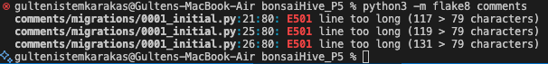
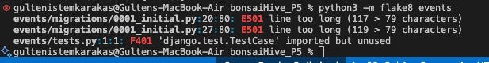
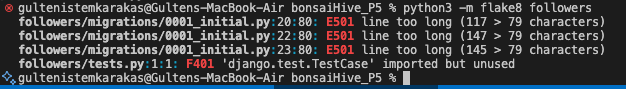
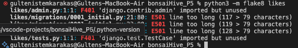
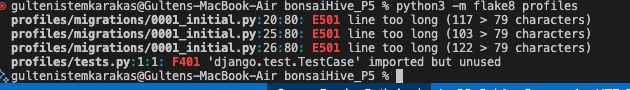
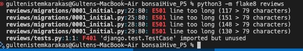

# Contents

- [PEP8 & Flake8 Validation](#pep8--flake8-validation)
- [Manual Testing](#manual-testing)
- [Bugs](#bugs)

# PEP8 & Flake8 Validation

All Python code in the DRF project has been validated using **Flake8**.

- Most linting issues have been resolved.
- Exceptions: Lines that are too long in **migration files**. These files are auto-generated by Django, so these warnings were intentionally left unresolved.

**Flake8 / Linter Validation Notes:**  
During Flake8 validation, some warnings may appear from files inside the virtual environment or other third-party libraries.  
These warnings include common issues such as long lines, missing newlines, or minor formatting inconsistencies.  
They are not related to the project code and do not affect functionality.  
All project-specific code has been cleaned and validated according to PEP8 and Flake8 rules.  
Warnings from third-party packages can be safely ignored.

Screenshots of the Flake8 output are included below.















<a href="#top">Back to the top</a>

## Manual Testing

| #   | Endpoint                       | Method | Expected outcome      | Pass/Fail |
| --- | ------------------------------ | ------ | --------------------- | --------- |
|     | **Comments**                   |        |                       |           |
| 10  | /comments                      | GET    | List all comments     | ✅        |
| 11  | /comments                      | POST   | Create a new comment  | ✅        |
| 12  | /comments/:id                  | PUT    | Update own comment    | ✅        |
| 13  | /comments/:id                  | DELETE | Delete own comment    | ✅        |
|     | **Contacts**                   |        |                       |           |
| 14  | /contact                       | GET    | Show contact form     | ✅        |
| 15  | /contact                       | POST   | Create a new message  | ✅        |
| 16  | /contact_list (Admin only)     | GET    | List all messages     | ✅        |
| 17  | /contact_list/:id (Admin only) | GET    | View selected message | ✅        |
|     | **Events**                     |        |                       |           |
| 18  | /events                        | GET    | List all events       | ✅        |
| 19  | /events                        | POST   | Create a new event    | ✅        |
| 20  | /events/:id                    | PUT    | Update event          | ✅        |
| 21  | /events/:id                    | DELETE | Delete event          | ✅        |
|     | **Followers**                  |        |                       |           |
| 22  | /followers                     | GET    | List of followers     | ✅        |
| 23  | /followers                     | POST   | Follow a user         | ✅        |
| 24  | /followers/:id                 | DELETE | Unfollow a user       | ✅        |
|     | **Likes**                      |        |                       |           |
| 25  | /likes                         | GET    | List of likes         | ✅        |
| 26  | /likes                         | POST   | Like a post           | ✅        |
| 27  | /likes/:id                     | DELETE | Remove like           | ✅        |
|     | **Posts**                      |        |                       |           |
| 28  | /posts                         | GET    | List all posts        | ✅        |
| 29  | /posts                         | POST   | Create a new post     | ✅        |
| 30  | /posts/:id                     | PUT    | Update own post       | ✅        |
| 31  | /posts/:id                     | DELETE | Delete own post       | ✅        |
|     | **Profiles**                   |        |                       |           |
| 32  | /profiles                      | GET    | List all profiles     | ✅        |
| 33  | /profiles/:id                  | GET    | Profile details       | ✅        |
| 34  | /profiles/:id                  | PUT    | Update own profile    | ✅        |
| 35  | /profiles/:id                  | DELETE | Delete own profile    | ✅        |
|     | **Reviews**                    |        |                       |           |
| 36  | /reviews                       | GET    | List all reviews      | ✅        |
| 37  | /reviews                       | POST   | Create a new review   | ✅        |
| 38  | /reviews/:id                   | PUT    | Update own review     | ✅        |
| 39  | /reviews/:id                   | DELETE | Delete own review     | ✅        |

<a href="#top">Back to the top</a>

## BUGS

**Issue:**
Running python manage.py collectstatic --noinput fails locally (e.g., in VSCode) and prevents deployment on Heroku.

**Cause:**
The problem was due to the order of apps in settings.py. Whitenoise needed to be listed before django.contrib.admin.

**Solution:**
Reorder the apps in settings.py so that Whitenoise comes before the admin app. After this change, collectstatic --noinput works both locally and on Heroku.

---

**Issue:**  
The frontend was unable to communicate with the backend due to CORS policy restrictions. This resulted in:

- Sign-in and sign-up forms not working
- Contact form submissions having no effect
- Reviews and other API requests failing to load

Error message shown in the browser console:  
When trying to make requests from the frontend to the backend, the browser console displayed a CORS-related error message indicating that the request was blocked due to missing 'Access-Control-Allow-Origin' headers.

**Cause:**  
The backend CORS configuration did not allow requests from the deployed frontend domain.

**Solution:**

- Added `django-cors-headers` to the project and included it in `MIDDLEWARE`.
- Updated `settings.py` to read allowed origins from environment variables:

  ```python
  if "CLIENT_ORIGIN" in os.environ:
      allowed_origins = list(filter(None, [
          os.environ.get("CLIENT_ORIGIN"),
          os.environ.get("CLIENT_ORIGIN_CUSTOM_DOMAIN")
      ]))
      CORS_ALLOWED_ORIGINS.extend(allowed_origins)
  ```

Configured Heroku (or environment) variables with the frontend URLs for both production and development environments:

- `CLIENT_ORIGIN` = your deployed frontend URL
- `CLIENT_ORIGIN_DEV` = your local frontend URL (development)

<a href="#top">Back to the top</a>
