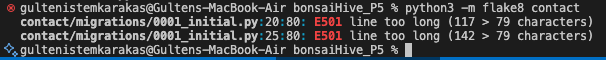
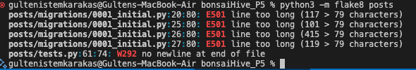

# Contents

- [PEP8 & Flake8 Validation](#pep8--Flake8--validation)
- [Manual Testing](#manual-testing)
- [Bugs](#bugs)

# PEP8 & Flake8 Validation

All Python code in the DRF project has been validated using **Flake8**.

- Most linting issues have been resolved.
- Exceptions: Lines that are too long in **migration files**. These files are auto-generated by Django, so these warnings were intentionally left unresolved.

Screenshots of the Flake8 output are included below.

